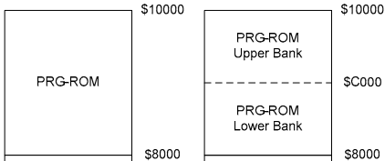

# CPU 详细设计
任天堂的 CPU 是由 6502 魔改过来的，叫做 2A03。它和 6502 的想同点如下：
1. 拥有相同的指令集（instruction set）使得编程体验上和 6502 非常相似；
2. 都是采用小端模式进行内存存储，即低位在前，高位在后。

不同点如下：
1. 2A03 能够进行声音处理（pAPU）；
2. 2A03 阉割掉了 BCD(Binary Coded Decima) 模式，无法表示类似数码管的十进制表达，不过这对任天堂这类应用来说并不会有影响。

而对于我们来说，需要先知道 2A03 的机制与原理，然后再进行模拟方案设计，因此本文档章节如下：
- CPU 的内存布局
- 总线
- 指令与寻址模式
- CPU 指令周期
- CPU 的模拟设计

## 0. CPU 的内存布局/总线
2A03 的内存可分为如下 3 块：
1. ROM
2. RAM
3. I/O Registers

它们之间由总线进行串联，如下图所示：

### 0.0 总线
CPU 内存上的总线可分为 3 种：
1. data bus: 数据总线，位宽为 8 bits，用于各模块之间进行数据交换；
2. control bus：控制总线，位宽为 8 bits，表明对数据总线的操作，例如读/写；
3. address bus：地址总线，位宽为 16 bits，用于表示内存地址。

由于地址总线的位宽为 16 bits，因此 CPU 上的内存地址最大可表示为 2^16 = 64 KB 的内存，即 `$0000 ~ $FFFF`。

### 0.1 ROM
ROM 全称为 Read-Only-Memory，即只读内存，它从卡带（Cartridge）中加载而来，主要包含的是 `PRG-ROM`，即程序运行的指令集，它会被加载到 `$8000 ~ $10000` 的内存段上，大小为 32KB。卡带中的 `PRG-ROM` 大小均为 16KB，因此对于只有一个 `PRG-ROM` 的卡带，它的 `PRG-ROM` 会被加载 2 次，分别加载到地址 `$8000` 和 `$C000` 上；而对于有两个 `PRG-ROM` 的卡带，则是将其分别加载到 `$8000` 和 `$C000` 上，如下图所示：

### 0.2 I/O Registers

### 2. 指令与寻址模式
6502 的寻址模式共有以下11种：
- Zero Page
- Indexed Zero Page
- Absolute
- Indexed Absolute
- Indirect
- Implied
- Accumulator
- Immediate
- Relative
- Indexed Indirect
- Indirect Indexed
某一个指令可能具体一到多种寻址模式，它们通过不同的机器码来做区分，不同寻址模式的具体行为如下。

CPU指令集分类：按照指令集的寻址方式不同进行分类

http://www.oxyron.de/html/opcodes02.html