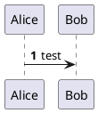

# NES 模拟器
NES 模拟器是一个通过软件模拟任天堂游戏机运行一些经典的任天堂游戏（如超级马里奥、金刚等）的一个开源项目。

这个项目基于学习的目的进行开发，主要目的是检验自身的开发水平，它主要包含以下几个部分：
- CMake、Bazel、Maven 等项目构建工具的使用与技巧；
- 跨平台项目的支持（Windows、Linux、MacOS）；
- 翔实的设计文档、类图以及模块对外接口，由设计指导开发；
- 设计模式的运用；
- 多语言的支持（C++、Java、Python）；
- 可靠的测试用例（GTest、GMock 的使用）。

## NES 模拟器整体介绍

## 参考资料
- [NESDoc](./NESDoc.pdf)
- 