# PPU
PPU 的全称为 Picture Process Unit，即图像处理单元，可以把它理解为 NES 的显卡，主要负责渲染每一帧游戏画面。PPU 的渲染原理分为如下几个小章节：
- PPU 和 CPU 的关系
- PPU 的内存布局
- PPU 的内部寄存器
- PPU 背景渲染原理
- PPU 精灵（Sprites）渲染原理
- PPU 扫描线（Scanline）
- PPU OAM
- PPU 滚动

## 0. PPU 和 CPU 的关系
在 NES 中，CPU 主要负责执行程序、接受外部输入、向 PPU 传输数据等，而 PPU 则主要负责对每一帧画面进行渲染。
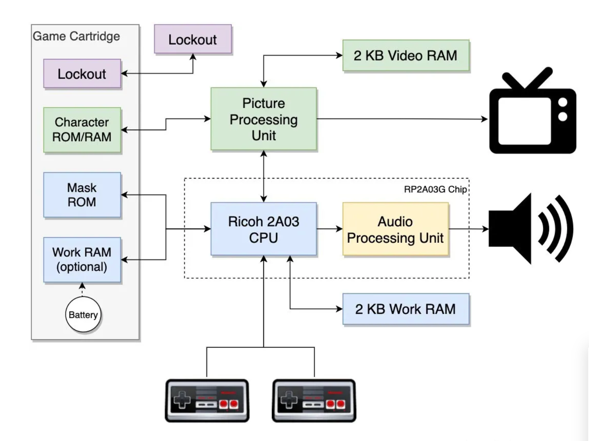
## 1. PPU 的内存布局
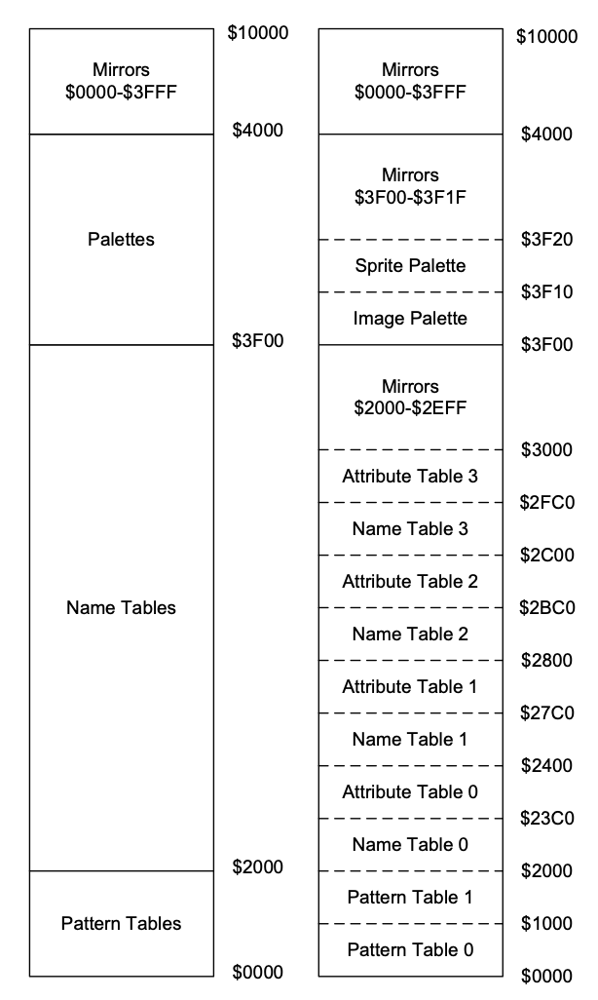
## 2. PPU 的内部寄存器
## 3. PPU 渲染原理
PPU 的渲染可以分为两个部分：分别为背景渲染以及精灵渲染。精灵即为我们在游戏中控制的角色以及一些可移动的物体，如马里奥、库巴、蘑菇等，这两者渲染的结合最后便组成了我们的游戏画面。而这里面首先需要解决的就是如何获取到游戏画面的数据以及这些数据是如何进行渲染的。这里面会涉及到 PPU 几个核心的概念：
- 样式表（Pattern Table）
- 调色盘（Palette）
- 名字表（Name Table）
- 属性表（Attribute Table）
- OAM

### 3.0 Pattern Table
Pattern Table 即为样式表，它储存在卡带（Cartiage）的 CHR ROM 中，并且只能被 PPU 通过 PPU Bus 的方式进行访问。它里面储存的便是我们的游戏画面，它们以 Tile 为粒度进行存储。

卡带中有两个 Pattern Table，分别映射到了 PPU 的 $0000~$0FFFF 以及 $1000 ~$1FFF。无论是背景还是精灵，它们的图像数据均来源于 Pattern Table。

Tile 又称图元，是一个图像的最小单位，一个 Tile 占用 16 bytes，可以渲染 8x8 的像素，原理为将 Tile 对应的数据按照 8 bytes 分为前后两片，以下列数据为例：
```bash
# Address   Value
$0000       0x10
$0001       0x00
$0002       0x44
$0003       0x00
$0004       0xFE
$0005       0x00
$0006       0x82
$0007       0x00

$0008       0x00
$0009       0x28
$000A       0x44
$000B       0x82
$000C       0x00
$000D       0x82
$000E       0x82
$000F       0x00
```
将它们按照 8 bytes 分为两块（$0000~$0007 以及 $0008~$000F）并且按照bitmap 展开后如下所示：
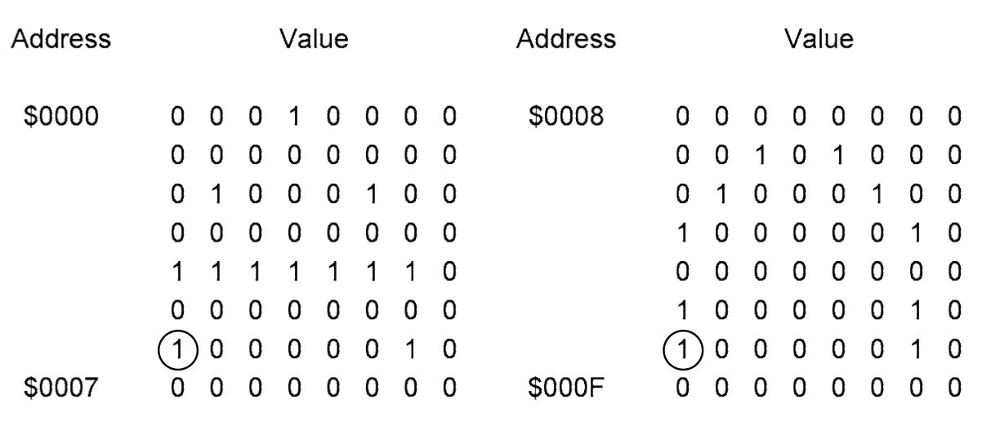

然后将它们按位进行组合，$0000~$0007 的 bit 位为低位，$0008 ~ $000F 的为高位，便可以组成 00B，01B，10B，11B 这 4 种组合，例如图中所圈出来的 bit 位，它们便可以组合成 11B。最终它们可以组合成如下的图案：
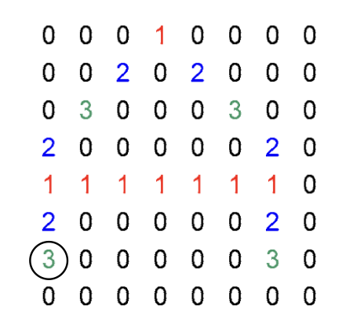
如果我们将 01B，10B 以及 11B 着色，会发现显示出来的是一个字母 'A'。至此，我们便将一个 8x8 像素的图像给渲染出来了。而上面的数字，则是对应于 Palette（调色盘）的颜色编号，当将其颜色渲染到对应的像素点时，我们带有颜色的图像也就可以显现出来了。

而 Pattern Table 总共有 8 KB（$0000~$1FFFF），因此其总共可以存储 512 个 Tile。

### 3.1 Name Table
当我们知道如何渲染出 Pattern Table 中每个 Tile 的游戏画面之后，还需要解决的一个问题就是：如何将这些 Tile 按照一定的顺序进行排列，从而组成一幅完整的游戏画面，而这就是 Name Table 所需要做的事情。

Name Table 本质上就是一个 32x30 的 Tile 矩阵，Name Table 中的每个 bytes 指向的是 Tile 在 Pattern Table 中的索引，而每个 Tile 表示的是 8x8 的像素，因此 Name Table 即可表示 256x240 分辨率的画面。

Name Table 的矩阵可按照每 32 bytes 为一行，共 30 行看待，如下所示：
```bash
$2000, $2001, ... $201E, $201F,
$2020, $2021, ... $203E, $203F,
...
$2380, $2381, ... $24BE, $24BF,
$23A0, $23A1, ... $23BE, $23BF,
```
PPU 共有 4 个 Name Table，它们的分布如下所示：
```bash
+------------+------------+
|            |            |
|            |            |
| NameTable0 | NameTable1 |
|            |            |
|            |            |
+------------+------------+
|            |            |
|            |            |
| NameTable2 | NameTable3 |
|            |            |
|            |            |
+------------+------------+
```

4 个 NameTable 总共可渲染出 512x480 的图像，但是我们的屏幕只有 256x240，意味着总共可以渲染出 4 块屏幕，而这是为了能够平滑移动所设计的，图像的边缘已经渲染好，使得移动的时候图像渲染能够非常的平滑。

而实际上，PPU 仅有 2KB 的内存用于存储 Name Table 以及 Attribute Table，因此 PPU 的内存中只能同时存下两个 Name Table 的数据，所以会采用镜像的方式去填充数据，不同的游戏镜像方式会有所不同。

水平镜像如下所示：
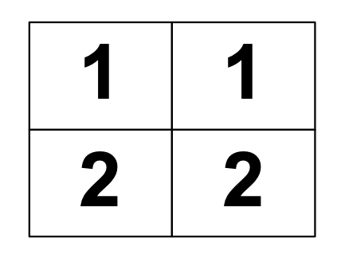

垂直镜像如下所示：
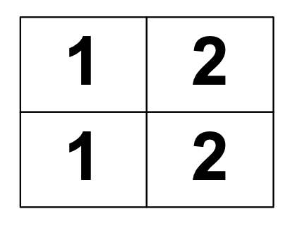

单屏镜像：
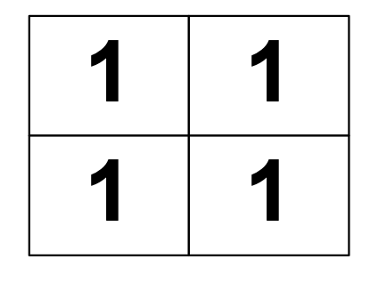

不使用镜像：
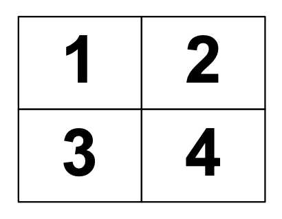

不使用镜像这种方式需要卡带额外再提供 2 KB 的内存。

### 3.2 Attribute Table
每一个 Name Table 的尾部都会跟有一个大小为 64 bytes 的 Attribute Table，它的作用是指明每个 Tile 需要用哪个调色板进行着色。由于 Attribute Table 只有 64 bytes，而 Name Table 则有 960 bytes，因此 Attribute Table 中的每一个字节需要管理 16 个 Tile，这些 Tile 按照 4x4 的大小进行分割，将这 4x4 的 Tile 称为一个 block，如下所示：

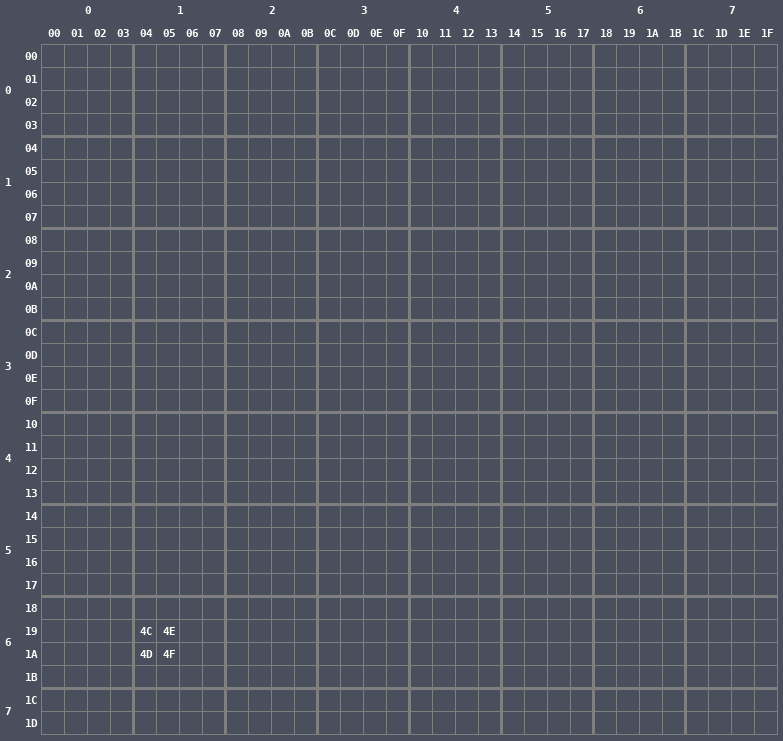

而每个 block 又可继续分为 4 个 2x2 Tile，我们称之为 sub-block，如下所示：

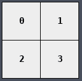

0～4 分别表示 1 个 block 下的 4 个 sub-block，每个 sub-block 代表了 Attribute Table 每个字节上 bit 位的分布，如下所示：
```bash
7654 3210
|||| ||++- Color bits 1-0 for sub-block 0
|||| ++--- Color bits 3-2 for sub-block 1
||++------ Color bits 3-2 for sub-block 2
++-------- Color bits 3-2 for sub-block 3
```

根据 Attribute Table 的每个字节，我们就能确认每个 block 用什么调色板去进行着色。例如 Attribute Table 中的某一个字节为 0xAA，那么它的 bit 位表示为：
```bash
10 10 10 10
|| || || ++- Color bits 1-0 for sub-block 0
|| || ++---- Color bits 3-2 for sub-block 1
|| ++------- Color bits 3-2 for sub-block 2
++---------- Color bits 3-2 for sub-block 3
```
因此它表示这个 block 下的所有的 Tile 都是用 2 号调色板进行着色。

### 3.4 OAM
参考链接：https://www.nesdev.org/wiki/PPU_OAM

上述对于 Name Table，Attribute Table 解决的事背景的排布和渲染，而当背景渲染解决了之后，还有另一块需要渲染的就是精灵的渲染。不同于背景有固定的放置位置，精灵往往是可以移动的单位，因此它需要有更多的字节用于表示 X, Y 坐标、翻转等信息，而这一块就是 OAM 所需要解决的事情。

OAM 全称为 Object Attribute Memory，是PPU内部一块用于保存精灵（sprits）信息的独立内存。章节如下：
- 内存布局
- 角色（Character）和精灵（Sprite）的关系
- 渲染优先级
- Sprite 0 Hit
- 扫描线（Scanline）与精灵（Sprite）
- OAM 同步

#### 3.4.0 内存布局
OAM 的内存大小为 256 bytes，至多可以存储 64 个精灵，每个精灵共占据4个字节，这4个字节的表示如下所示：

Byte 0
---
表示精灵的 Y 坐标，由于精灵永远不会显示在屏幕的第一行，因此精灵实际的 Y 坐标需要减去 1。在需要隐藏精灵时，可以通过将精灵向下移动到屏幕外来实现隐藏的效果，方法是将该字节写入 #EF ～ #FF 之间的任意值。精灵的隐藏永远是向下隐藏，它永远不会显示在屏幕的顶部之外。

Byte 1
---
表示精灵 Tile 的索引值，精灵的 Tile 有两种规格：8x8 的以及 8x16 的，这两种规格的取法略有不同，具体如下：

对于 8x8 的 Tile 来说，该值指的就是样式表（Pattern Table）上的索引，而具体为哪个样式表则由 PPUCTRL($2000) 的 bit 3 所决定；

对于 8x16 的 Tile 来说，样式表（Pattern Table）的选择则是直接由 bit 0 所决定的，具体如下所示：

```bash
76543210
||||||||
|||||||+- Bank ($0000 or $1000) of tiles
+++++++-- Tile number of top of sprite (0 to 254; bottom half gets the next tile)
```

因此，它的取值所对应的 Tile 索引如下所示：

```bash
$00: $0000-$001F
$01: $1000-$101F
$02: $0020-$003F
$03: $1020-$103F
$04: $0040-$005F
[...]
$FE: $0FE0-$0FFF
$FF: $1FE0-$1FFF
```

Byte 2
---
表示精灵的属性，各个 bit 位的具体表示如下：
```bash
76543210
||||||||
||||||++- Palette (4 to 7) of sprite
|||+++--- Unimplemented (read 0)
||+------ Priority (0: in front of background; 1: behind background)
|+------- Flip sprite horizontally
+-------- Flip sprite vertically
```
其中 bit 0 和 bit 1 用于表示调色板的编号，用于制定精灵的颜色；bit 5 表示与背景板的优先级，0 表示渲染于背景前，1 表示渲染于背景后；bit 6 和 bit 7 分别表示水平/垂直翻转。

Byte 3
---
精灵的 X 坐标（#00 ~ #FF）。

### 3.4.1 Character 和 Sprite 的关系
一个游戏内通常包含着不少角色（Character），例如超级马里奥中就有马里奥、库巴、蘑菇等可以移动的角色，这些角色通常由 1～n 个精灵（Sprite）组成，例如下面的马里奥就是由 8 个精灵组成的 4x2 的角色：
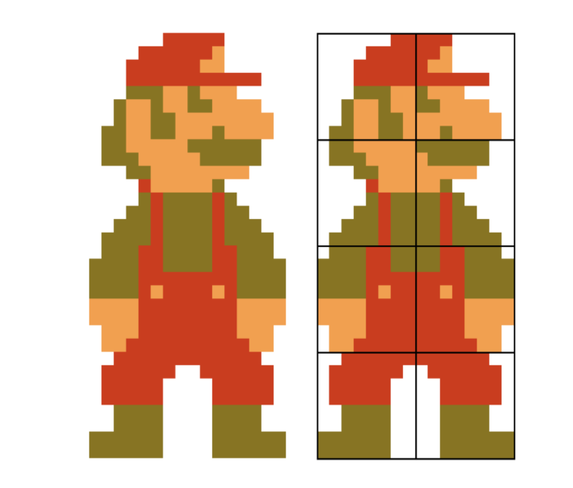

### 3.4.2 渲染优先级
精灵本身的渲染是有优先级的，它们的优先级即为它们在 OAM 中的索引值（0～63），其中 0 优先级最高。当多个不同的精灵渲染到同一个像素的时候，优先级高的精灵会覆盖掉优先级低的精灵。

除此之外，Byte 2 的 bit 5 表示了精灵和背景谁被渲染的优先级，如果该 bit 位为 1，那么精灵也将不会被渲染出来。这种可以表示角色的一部分身体藏在树后面的场景。

### 3.4.3 Sprite 0 Hit
当第 0 个 Sprite 被渲染（其首个像素覆盖到了非透明的背景像素）时，被称为Sprite Zero Hit。PPU 寄存器 PPUSTATUS 中的 bit 6 将会被设置，来记录Sprite Zero Hit。

### 3.4.4 Scanline & Sprite
每一条扫描线（Scanline）在渲染像素的时候，都会检查并计算是否有需要进行渲染的精灵（Sprite），如果有的话就会对相应的像素进行渲染。需要注意的是每条扫描线最多只能支持8个精灵的渲染，当某一行扫描线的精灵超过 8 个时候，只能渲染出前 8 个精灵，这种现象被称为 Sprite  Overflow，此时 PPUSTATUS 中的 bit 5 会被设置，用于记录 Sprite Overflow。

由于这种限制的存在，当游戏内的角色非常多时（例如魂斗罗），我们会看到画面中的角色出现闪烁的现象。

### 3.4.5 OAM 同步
OAM 的数据同步有两种方式：
1. 设置 OAMADDR 以及 OAMDATA 进行更新
2. 通过 DMA 进行更新

设置 OAMADDR 以及 OAMDATA 进行更新
---
CPU 通过写入 $2003（OAMADDR），将某个 OAM 的地址起始值写入 PPU 的 OAMADDR 寄存器。
接着，CPU 通过写入 $2004（OAMDATA），将数据写入 OAMADDR 所指向的地址，从而完成某个 OAM 的更新。

这种方式的缺点是执行的 CPU 周期非常多，更新慢，因此很少使用这种方式进行更新。

通过 DMA 进行更新
---
DMA 全称为 Direct Memory Access，它允许将 CPU 中某一页（256 bytes）的内存直接更新到 OAM 中。具体方式是 CPU 通过写入 $4014（OAMDMA），指定一个内存页，接着经过 513-514 个 CPU 时钟周期，这一页中的 256 个字节将会被拷贝到 OAM 中。这是最常用的更新 Sprite 的方式。 

## 5. PPU 扫描线（Scanline）

